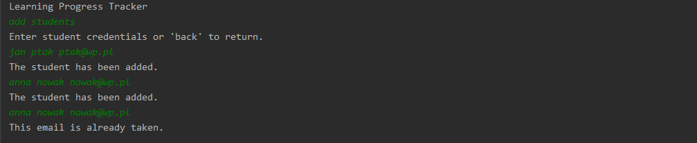
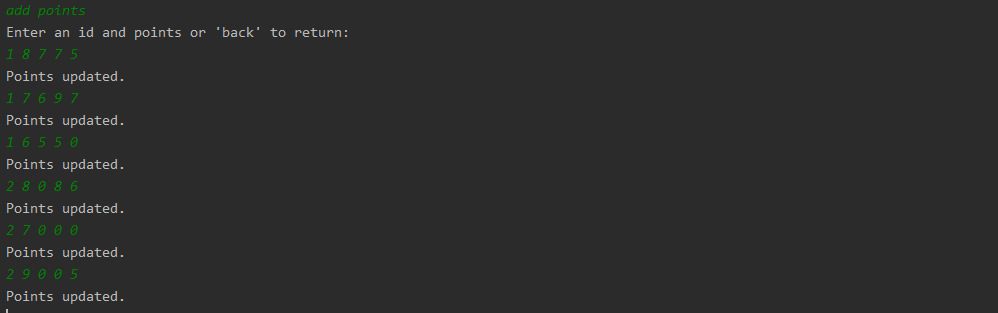
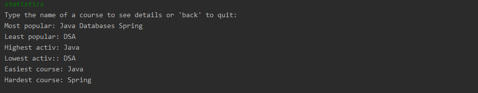
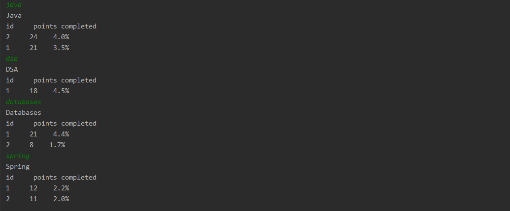

# LearningProgressTracker
A program that checks the progress of students' learning. The program allows you to add and validate new students. Record points and process statistics based on entered data. The program uses string processing
and the use of various types of collections and streams to obtain statistics for both individual students and the entire saved data.

## Illustrations

### Add students

### Add points

### Statistics

### Statistics detailed

